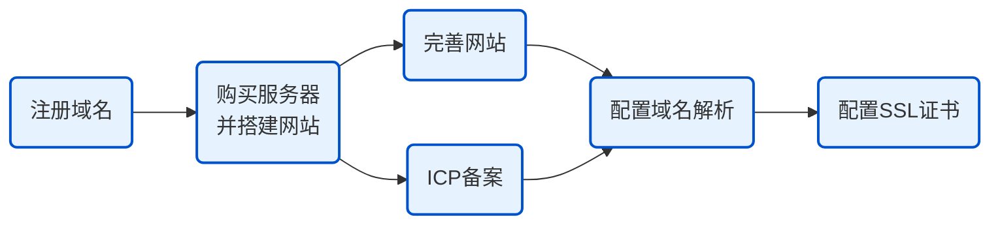

---

title: 个人博客搭建 - 域名篇

published: 2026-02-01

updated: 2026-02-01

description: '域名的选择和购买'

image: ''

tags: [Blogging,Freshman,Domain]

category: 'Experience'

draft: false

---

# 个人博客搭建 - 域名篇

## 起源

心血来潮，想搭建个人的博客，独属于一个人的网络空间。

非计算机专业，但是在互联网和AI的时代，解决遇到的难题是比较轻松的。

## 信息

> 兵马未动，粮草先行。
>

查看了网站搭建的大概流程，大致如下：

**参考**：[如何通过阿里云搭建网站-域名(Domain)-阿里云帮助中心](https://help.aliyun.com/zh/dws/getting-started/the-whole-process-of-website-building/)。

## 域名

### 抉择

1. **为什么不选择免费的域名？**
   **答**：非顶级域名+可能无法ICP备案+
   **参考**：[为什么不建议使用免费域名 - 知乎](https://zhuanlan.zhihu.com/p/29370371)
2. **选择什么的域名？**
   **答**：学生党白嫖不得，自然选择价格更低的。
   **参考**：[每年不到5块钱，史上最便宜的独立域名 ｜ 续费同价 ｜ xyz纯数字域名 ｜ 如何快速筛选靓号 -_Bilibili](https://www.bilibili.com/video/BV1Ve1KBWETi/)

在`Bilibili`寻找有关的域名服务商，其中有`spaceship`、`阿里云`、`腾讯云`等。其中`spaceship`的6位数字+`xyz`域名是价格最低的

原计划选择`spaceship`，价格会更低，但是考虑到国外服务商域名ICP备案需要将域名**转入**国内（需要转移到国内审批过的注册商才能备案，所以要备案建议直接在国内买）*

因为需要额外精力和费用，再加上客服服务等原因，因此选择了`阿里云`【域名购买、服务器购买、ICP备案、公安联网备案等服务】

### 对比

域名的参考价格【域名最多只能注册10年】

`ignorant.top`

|    厂商     |                 价格/年                 |
| :---------: | :-------------------------------------: |
| `spaceship` | **¥7.28**【首年】\| **¥26.70**【续费】 |
|  `阿里云`   | **¥14.00**【首年】\| **¥39.00**【续费】 |
|  `腾讯云`   | **¥14.00**【首年】\| **¥32.00**【续费】 |

`218502.xyz`

|    厂商     |                价格/年                |
| :---------: | :-----------------------------------: |
| `spaceship` | **¥4.65**【首年】\| **¥4.65**【续费】 |
|  `阿里云`   | **¥7.00**【首年】\| **¥7.00**【续费】 |
|  `腾讯云`   | **¥8.00**【首年】\| **¥8.00**【续费】 |

### 购买

1. 选择域名，点击购买。
2. 创建信息模板，填写实名认证
3. 立即购买，这时候会有域名证书【虽然花钱买证书，但是不知道为啥有点小兴奋😂】，证书在后面的备案需要用。

备注：阿里云域名证书查看方法

### 参考

- [迈向未来 - Spaceship](https://www.spaceship.com/zh/)
- [阿里云万网_域名注册_域名交易_建站_备案_资质_商标_软著-阿里云](https://wanwang.aliyun.com/)
- [域名注册购买_域名注册选购 - 腾讯云](https://buy.cloud.tencent.com/domain)
